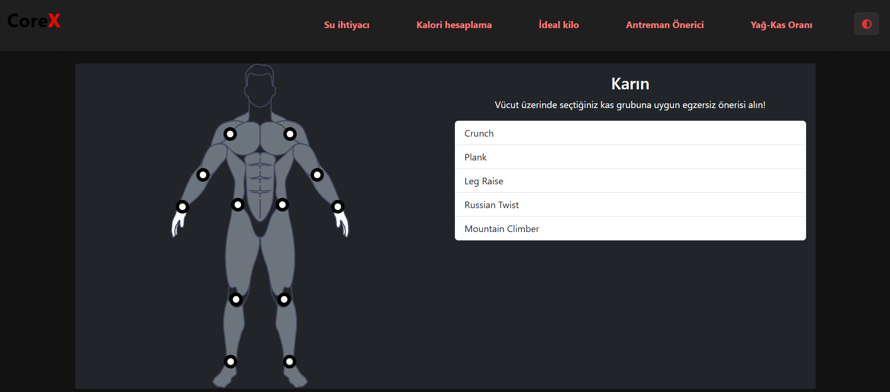
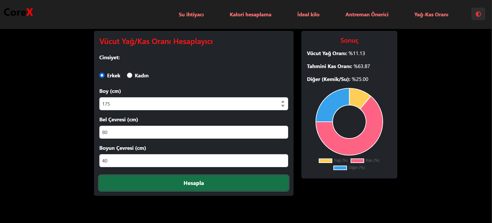

# CoreX - Fitness Tracker with Progress Visualization

CoreX, sağlıklı yaşamı destekleyen, kişisel antrenman programları ve diyet planları sunan, kullanıcı dostu bir web uygulamasıdır. Kullanıcılar; su ihtiyacı, günlük kalori ihtiyacı, ideal kilo ve yağ-kas oranı gibi sağlık metriklerini kolayca hesaplayabilir, ayrıca kişiselleştirilmiş antrenman önerileri alabilirler. Uygulama, modern ve responsive bir arayüze sahiptir ve karanlık mod desteği sunar.

## Özellikler

- **Günlük Su İhtiyacı Hesaplama:** Kilonuza göre günlük içmeniz gereken su miktarını hesaplar ve grafikle gösterir.
- **Günlük Kalori İhtiyacı Hesaplama:** Yaş, cinsiyet, boy, kilo ve aktivite seviyenize göre günlük kalori ihtiyacınızı hesaplar ve makro dağılımını grafikle sunar.
- **İdeal Kilo Hesaplama:** Boy, kilo, yaş ve cinsiyet bilgilerinize göre ideal kilonuzu ve vücut kitle indeksinizi (BMI) hesaplar.
- **Yağ-Kas Oranı Hesaplama:** Bel, boyun, kalça çevresi gibi ölçümlerle vücut yağ oranınızı ve kas oranınızı hesaplar, sonuçları grafikle gösterir.
- **Antrenman Önerici:** Hedeflerinize ve seviyenize uygun egzersiz programları önerir.
- **Karanlık Mod:** Kullanıcılar arayüzü karanlık moda alabilir.
- **Mobil Uyumlu ve Modern Tasarım:** Bootstrap ile responsive ve şık bir arayüz.
- **Grafiksel Sonuçlar:** Chart.js ile görselleştirilmiş sağlık metrikleri.

## Kurulum

1. Bu repoyu klonlayın:
   ```bash
   git clone https://github.com/hasanbyrktr/CoreX-Fitness-Tracker-with-Progress-Visualization.git
   ```
2. Klasöre girin:
   ```bash
   cd Fitness-Tracker-with-Progress-Visualization
   ```
3. Herhangi bir sunucuya gerek olmadan, `index.html` dosyasını çift tıklayarak veya bir canlı sunucu (Live Server eklentisi gibi) ile açabilirsiniz.

## Kullanılan Teknolojiler

- **HTML5, CSS3, JavaScript**
- **Bootstrap 5** (responsive tasarım için)
- **Chart.js** (grafikler için)
- **FontAwesome** (ikonlar için)

## Klasör Yapısı

```
.
├── index.html                # Ana sayfa
├── exercise/                 # Antrenman önerici modülü
│   └── exercise.html
├── fat-muscle-chart/         # Yağ-kas oranı hesaplama modülü
│   ├── fat-muscle.html
│   ├── fat-muscle.js
│   └── style.css
├── calculate/
│   ├── water/                # Su ihtiyacı hesaplama
│   │   ├── water.html
│   │   ├── water.js
│   │   └── water.css
│   ├── calorie/              # Kalori ihtiyacı hesaplama
│   │   ├── calorie.html
│   │   ├── calorie.js
│   │   └── calorie.css
│   └── ideal-weight/         # İdeal kilo hesaplama
│       ├── idealweight.html
│       ├── idealweight.js
│       └── idealweight.css
├── assets/                   # Görseller ve videolar
│   ├── img/
│   └── video/
└── README.md
```

## Ekran Görüntüleri




